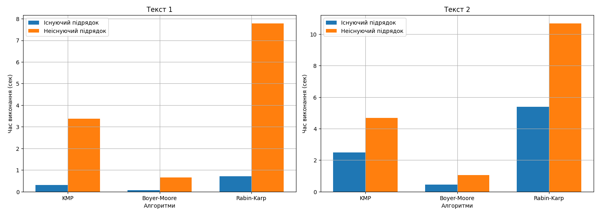

# Порівняння алгоритмів пошуку підрядка

У цьому дослідженні було порівняно ефективність трьох алгоритмів пошуку підрядка: Кнута-Морріса-Пратта, Боєра-Мура та Рабіна-Карпа. Для цього вимірявся час їх виконання з використанням бібліотеки `timeit` для двох видів підрядків (існуючого та вигаданого) у двох текстових файлах.

## Таблиця порівняння

| Алгоритм             | Текст 1 (існуючий) | Текст 1 (вигаданий) | Текст 2 (існуючий) | Текст 2 (вигаданий) |
| -------------------- | ------------------ | ------------------- | ------------------ | ------------------- |
| Кнута-Морріса-Пратта | 0.28 сек           | 3.30 сек            | 2.25 сек           | 4.57 сек            |
| Боєра-Мура           | 0.05 сек           | 0.74 сек            | 0.41 сек           | 0.89 сек            |
| Рабіна-Карпа         | 0.60 сек           | 7.43 сек            | 5.40 сек           | 10.30 сек           |

## Графіки порівняння

## Висновки

### Алгоритм Кнута-Морріса-Пратта:

Для існуючих підрядків алгоритм виявився помірно швидким, займаючи друге місце в обох текстах. Його швидкість виконання була в межах від 0.28 до 2.25 секунд. Однак для вигаданих підрядків алгоритм показав гіршу ефективність, займаючи останнє місце в обох текстах. Час виконання збільшився до 3.30 - 4.57 секунд.

### Алгоритм Боєра-Мура:

Алгоритм продемонстрував найкращі результати для обох типів підрядків у всіх текстах. Його час виконання був значно меншим ніж у інших алгоритмів. Він показав найкращу ефективність, займаючи перше місце з часом від 0.05 до 0.89 секунд.

### Алгоритм Рабіна-Карпа:

Рабін-Карп показав схожу ефективність з алгоритмом Кнута-Морріса-Пратта для існуючих підрядків, але був найповільнішим для вигаданих підрядків у обох текстах. Його час виконання коливався від 0.60 до 5.40 секунд для існуючих підрядків і від 7.43 до 10.30 секунд для вигаданих підрядків.

### Загальні висновки:

-   На основі вимірювання часу виконання для існуючих підрядків, найшвидшим алгоритмом виявився Боєра-Мура.
-   Для вигаданих підрядків також найшвидшим алгоритмом виявився Боєра-Мура.
-   Алгоритм Кнута-Морріса-Пратта показав найгірші результати порівняно з іншими алгоритмами у всіх випадках.
